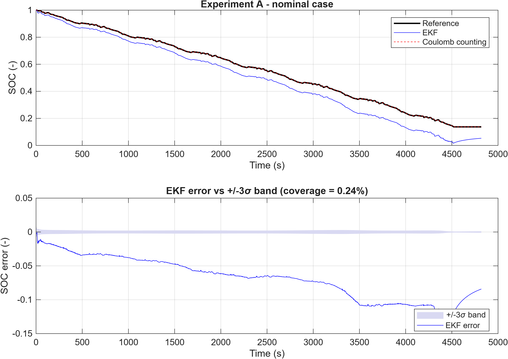
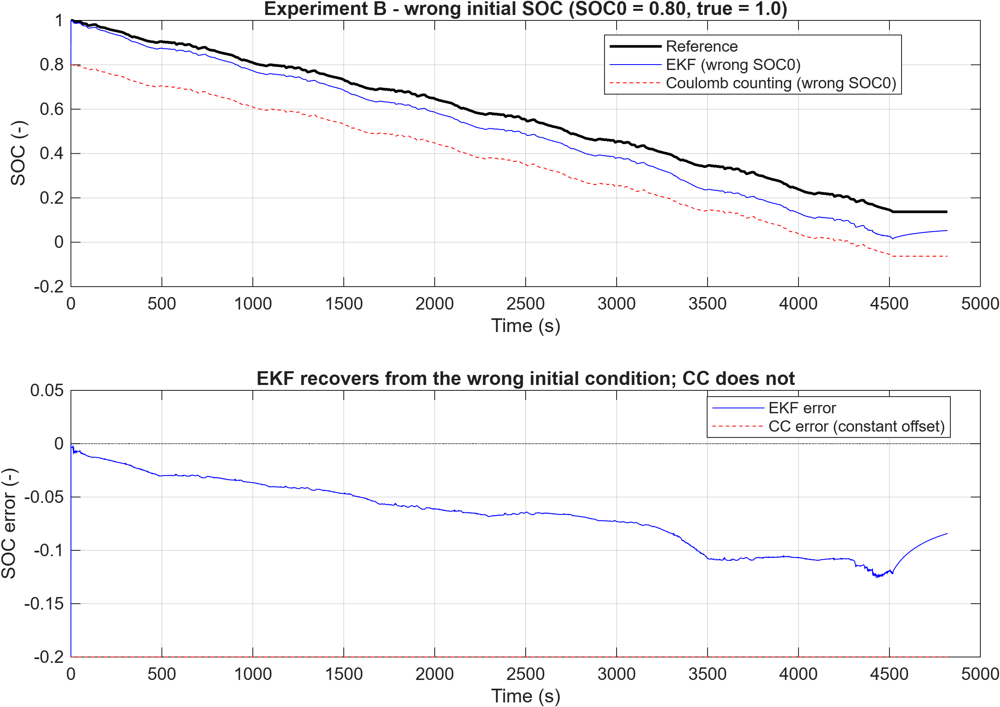
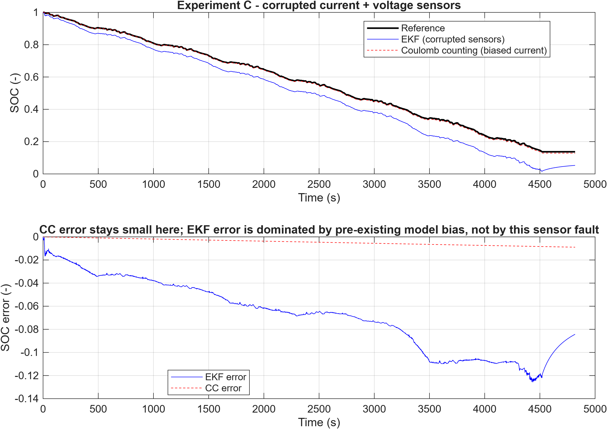
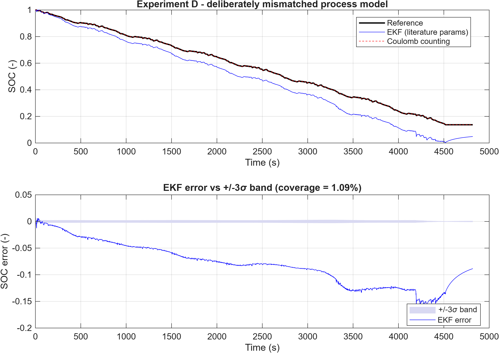
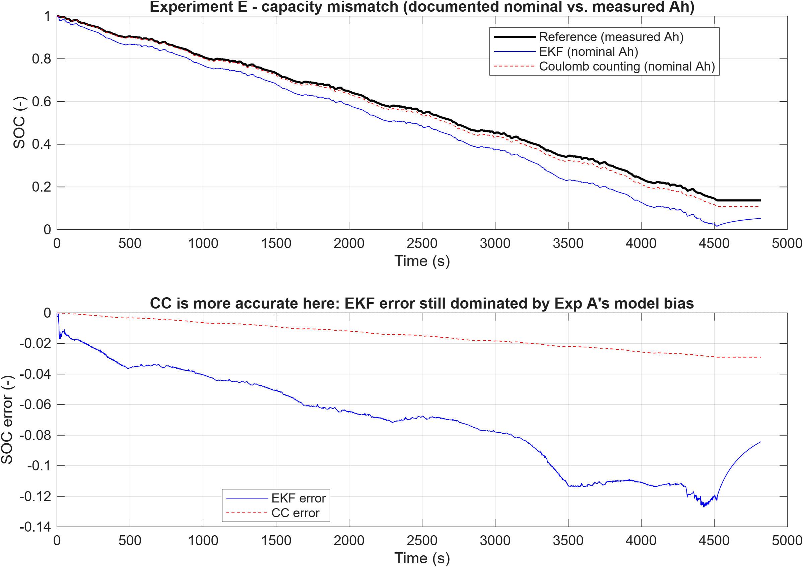

## Abstract

A state-of-charge (SOC) estimator was built end-to-end for a real Panasonic
NCR18650PF cell and benchmarked against plain Coulomb counting across five
conditions: a nominal case plus four deliberately introduced faults. The cell
was characterised from public C/20 OCV and HPPC pulse data, a 1-RC
equivalent-circuit model (ECM) was identified from that data, and an Extended
Kalman Filter (EKF) was built around it and re-implemented as a Simulink
MATLAB Function block agreeing with the MATLAB reference to within 1e-9 SOC.
The EKF is not a uniform improvement. It recovers from a wrong initial SOC,
where Coulomb counting drifts to 20% error and cannot correct itself, but it
loses under sensor noise and capacity mismatch, because its accuracy is bounded
throughout by the ECM's own +71.7 mV voltage-fit bias rather than by the filter
recursion. That bias also explains a badly miscalibrated ±3σ band, and it was
measured and reported instead of tuned away. Which estimator wins depends on the
size of the fault relative to the model error underneath it.

# 1. Introduction and Motivation

A battery management system needs to know a cell's state of charge (SOC)
at every moment, but SOC can't be measured directly — it has to be
estimated from the current and voltage the system can actually read.
The simplest approach, Coulomb counting (CC), just integrates measured
current over time. It's cheap, and it's exact if its inputs are exact,
but it has no way to correct itself: a wrong starting SOC, a biased
current sensor, or a wrong assumed capacity all just accumulate as error
forever. A model-based estimator can do better in principle because it
also uses the terminal voltage. An Extended Kalman Filter (EKF) built on
an Equivalent Circuit Model (ECM) combines a current-based prediction
with a voltage-based correction at every sample [3, 4].

This project builds both estimators for a real Panasonic NCR18650PF cell
and compares them under five conditions, all on real laboratory
measurements and no synthetic cell data: a nominal case, plus four
deliberately introduced faults (wrong initial SOC, corrupted sensors, a
mismatched process model, and a wrong assumed capacity). The EKF doesn't
win every time, and that turned out to be the more interesting part of
the project — working out when and why each estimator is more accurate,
on one real cell and one real drive cycle, with every assumption stated
explicitly.

# 2. Data and Characterisation

All data come from the public Kollmeyer/Mendeley Panasonic 18650PF
dataset at 25 °C [1]: a C/20 (slow, near-equilibrium) full
discharge/charge cycle used to characterise capacity and open-circuit
voltage (OCV), and a US06 drive-cycle discharge record used to evaluate
the estimators. Discharge current is defined positive throughout
(`I = -Current` from the raw file), fixed once in `src/loadDataset.m` so
the sign convention can't drift between scripts.

**Capacity.** Right-endpoint, boundary-inclusive integration of the C/20
discharge branch gives a measured capacity of **2.997 Ah**, which
lines up with the dataset's own `Ah` counter to within 0.01%. The
commonly cited nominal capacity for this cell is 2.9 Ah. The two values
differ by about 3.2%, and that gap is exploited on purpose later, in
Experiment E.

**Open-circuit voltage.** OCV isn't measured directly at every SOC — it's
approximated from the low-rate (C/20) discharge and charge branches,
averaged together. The two branches don't sit exactly on top of each
other (mean interior separation ≈ 44.7 mV), which is rate-driven
separation rather than modeled equilibrium hysteresis, but averaging them
is a reasonable way to split the difference. The averaged 101-point
target (rested endpoints plus 99 interior branch means) is fit with a
degree-9 polynomial: RMSE 6.72 mV, maximum target error 22.27 mV, across
the full physical range `SOC ∈ [0,1]`. The polynomial's analytic
derivative feeds the EKF's measurement Jacobian directly.

**ECM parameters.** Two independent 1-RC parameter sets were obtained: a
literature-derived set (the 25 °C, SOC = 0.5 row of the same-cell
first-order Thevenin table reported by Tang et al. [2]) and a set
identified from this project's own HPPC pulse data [5] (one bounded
global least-squares fit over 64 qualifying pulses). Against the real
US06 record, the HPPC-identified set fits noticeably better (bias
+71.7 mV, RMSE 83.8 mV) than the literature set (bias +89.2 mV, RMSE
114.3 mV), so it's used as the nominal model. The literature set is kept
unmodified and repurposed later as a deliberately worse model, for
Experiment D.

# 3. Model and Estimator

**Equivalent Circuit Model.** A 1-RC Thevenin model: terminal voltage
`V = OCV(SOC) - V1 - R0*I`, with `V1` the RC-branch voltage relaxing at
time constant `tau = R1*C1`. State update, using the actual (non-uniform)
sample interval `dt_k` and a right-endpoint timing convention applied
consistently across every function in the project:

```
SOC(k) = SOC(k-1) - (dt_k / Q_As) * I(k)
V1(k)  = alpha_k * V1(k-1) + (1 - alpha_k) * R1 * I(k),   alpha_k = exp(-dt_k/tau)
```

**Extended Kalman Filter.** State vector `x = [SOC; V1]`. The state
transition itself is linear (`F = [1,0; 0,alpha_k]`), but the measurement
model `V(k) = OCV(SOC(k)) - V1(k) - R0*I(k)` goes through the nonlinear
`OCV(SOC)` curve, which is why this is an EKF and not a plain KF — the
measurement Jacobian `H = [dOCV/dSOC(SOC_pred), -1]` gets re-linearized
around the predicted SOC every step. Otherwise it's the standard
predict/update recursion [3], with SOC clamped to `[0,1]` after each
update.

Three SOC trajectories are kept structurally separate throughout the
codebase, as separate MATLAB functions with disjoint input contracts that
never read each other's outputs, so that no estimator can end up "seeing"
the answer it's being scored against:

- `SOC_ref` — the reference trajectory, integrated from the clean current
  only. This isn't ground truth in the strict sense; SOC was never
  directly measured on this record, so `SOC_ref` is itself a
  protocol-supported assumption (`SOC_ref(1) = 1`), not an independently
  verified quantity.
- `SOC_CC` — Coulomb counting, seeing only whatever current (and initial
  SOC, and capacity) a given experiment assigns it, clean or corrupted.
- `SOC_EKF` — the EKF, seeing whatever current and voltage that
  experiment assigns it.

# 4. Evaluation Design

All five experiments run on the same real US06 discharge record. Each
one changes exactly one factor relative to Experiment A.

| Exp. | Condition | `SOC_CC` sees | `SOC_EKF` sees |
|---|---|---|---|
| A | Nominal | clean I, correct SOC0=1, measured Ah | clean I & V, correct SOC0, HPPC params |
| B | Wrong initial SOC | SOC0 = 0.8 (true = 1.0) | same wrong SOC0 = 0.8 |
| C | Corrupted sensors | I with constant +0.02 A bias | biased I *and* V with 3 mV std noise |
| D | Mismatched process model | clean I (unaffected) | literature ECM params instead of HPPC |
| E | Capacity mismatch | documented nominal 2.9 Ah (true 2.997 Ah) | same wrong 2.9 Ah in its own state equation |

Accuracy is scored against `SOC_ref` with RMSE, MAE, bias, and maximum
absolute error (`src/metrics.m`); the EKF also reports its ±3σ
uncertainty band and the fraction of samples that actually land inside
it, as a check on how well-calibrated the filter's own confidence is.

# 5. Results

| Experiment | Condition | EKF RMSE | CC RMSE | More accurate |
|---|---|---|---|---|
| A | Nominal | 7.4317% | n/a\* | — |
| B | Wrong initial SOC | 7.3955% | 20.0% | **EKF** |
| C | Current bias + voltage noise | 7.4455% | 0.5157% | **CC** |
| D | Mismatched process model | 8.9161% | n/a\*\* | — |
| E | Capacity mismatch | 7.7436% | 1.7294% | **CC** |

\*In Experiment A, CC sees the same clean current used to build
`SOC_ref`, so the two integrate identically by construction. Its error is
zero as a matter of matched integration, which is a consistency check and
not a skill comparison.
\*\*Experiment D only changes the EKF's process model; CC is unaffected,
so no comparison is meaningful.

All five experiments above were run in MATLAB/Simulink and confirmed
against an independent Python cross-check of the same equations before
being reported; see `docs/DECISIONS.md` for the full evidence trail.











**Filter calibration.** In every experiment, the EKF's ±3σ band covers
under 1.1% of samples (0.24% in Experiment A), far short of the ~99.7% a
well-calibrated filter should hit. Rather than patch over it, the cause
was tracked down: forward-simulating voltage from the true `SOC_ref` with
the HPPC parameters and comparing it to the real measured voltage gives a
residual of +71.7 mV bias, 83.8 mV RMSE, and dividing that bias by the
mean `dOCV/dSOC` over the visited SOC range reproduces the observed EKF
SOC bias almost exactly. The filter's reported uncertainty (`P`) only
accounts for the noise it was told about (`Q`, `R`) — it has no way to
know its own process model carries a real, un-modeled ~72 mV bias, so it
ends up more confident than it should be. `Q` was left alone: inflating
it would have swapped a traceable miscalibration for one that merely
looks better on paper.

# 6. Discussion

The headline finding is not that the EKF wins. It is that the two
estimators fail in different ways, and which one comes out ahead depends
on how big the fault is relative to the ECM's own model error.

Experiment B is the clearest case for the EKF. Coulomb counting has no
mechanism to correct a wrong starting point, so its error sits at a
constant 20 percentage points for the whole record, to numerical
precision. The EKF, pulled by its voltage update at every step, recovers
from the same −20% initial error down to a mean absolute error of about
9.3% over the back half of the record. It converges toward Experiment A's
own steady-state bias, not to zero, because the underlying ~72 mV model
bias is still sitting underneath the recovery the whole time.

Experiments C and E go the other way, at least in this specific setup. A
0.02 A current bias, or a 3.2% capacity error, only produces a
Coulomb-counting error of well under 2% — small, because the fault itself
is small. Meanwhile the EKF's error barely moves off its Experiment-A
baseline (about 7.4% up to 7.4–7.7%), because that baseline is already
dominated by the ECM's own voltage-fit bias. Fusing in voltage doesn't
help much when the voltage measurement is already carrying a bigger error
of its own than the fault being tested.

Experiment D isolates the process-model-quality question directly.
Swapping in the weaker-fitting literature parameter set in place of the
HPPC-identified one pushes RMSE from 7.43% up to 8.92% under otherwise
identical clean-signal conditions, which is about as clean a
demonstration as this project gets that EKF accuracy is bounded by ECM
voltage-fit quality, and not by anything in the Kalman machinery itself.

Put together, an EKF earns its extra complexity specifically against
faults Coulomb counting structurally can't recover from, like a bad
initial condition (and, by the same mechanism though untested here, a
reset after a long unmeasured rest). It isn't a strict improvement when
the fault being defended against is small next to the estimator's own
model error — and in that regime, the added complexity doesn't buy
anything back.

# 7. Limitations

- Everything here is at 25 °C; no temperature dependence is modeled.
- OCV is a branch average of low-rate charge/discharge data, not a
  modeled hysteresis term.
- The HPPC 1-RC parameter identification was run once, on a bounded,
  pre-qualified 64-pulse window, with no further re-identification or
  iterative tuning loop.
- `SOC_ref(1) = 1` is a protocol-supported working assumption (the US06
  record has no observed rest at its start), not a directly measured
  ground-truth anchor. That caveat applies to every RMSE/bias number in
  this report, since all of them are measured against `SOC_ref`.
- No state-of-health (SOH) estimation is attempted. Experiment E shows
  why a wrong capacity assumption matters for SOC accuracy; it doesn't
  estimate capacity fade itself.
- Real-time or embedded implementation concerns (fixed-point arithmetic,
  execution time budgets) aren't addressed.

# 8. Conclusion

Built and evaluated on one real Li-ion cell and one real drive cycle, a
1-RC ECM/EKF SOC estimator was compared against Coulomb counting across
five conditions. The EKF's clearest advantage, guaranteed by how each
estimator is structured, is recovering from a bad initial SOC, which
Coulomb counting simply cannot do. Everywhere else, its accuracy is
bounded by the underlying circuit model's own voltage-fit quality
(~72 mV local bias for the best parameter set available here). That
number was measured and reported instead of tuned away, and it turned
out large enough that for two of the five tested faults, the far simpler
Coulomb-counting baseline was actually the more accurate estimator. The
argument of this project is that trade-off, not a blanket claim that one
estimator beats the other.

# 9. Where this points next

The ~72 mV bias that bounds this estimator is a property of the empirical
circuit model, not of the filter. That distinction sets the direction of
the remaining work. In a 1-RC ECM, capacity fade enters only as a
parameter imposed from outside — which is exactly what Experiment E does
— and never as a state the model itself can resolve, so degradation can
be simulated here but not estimated. A reduced-order electrochemical
formulation changes that: ageing mechanisms become observable quantities
with physical meaning, which is the basis on which SOH and SOP estimation
can rest rather than SOC alone. Establishing how much model fidelity that
takes, and what it costs under embedded BMS constraints, is the natural
continuation of the work reported here.

# References

[1] Kollmeyer, P. (2018). *Panasonic 18650PF Li-ion Battery Data.*
Mendeley Data, V1. https://doi.org/10.17632/wykht8y7tg.1

[2] Tang, A., Gong, P., Huang, Y., Wu, X., & Yu, Q. (2023). Research on
pulse charging current of lithium-ion batteries for electric vehicles in
low-temperature environment. *Energy Reports*, 9(Supplement 7),
1447–1457. https://doi.org/10.1016/j.egyr.2023.04.226

[3] Plett, G. L. (2004). Extended Kalman filtering for battery management
systems of LiPB-based HEV battery packs: Part 3. State and parameter
estimation. *Journal of Power Sources*, 134(2), 277–292.

[4] Plett, G. L. (2015). *Battery Management Systems, Volume II:
Equivalent-Circuit Methods.* Artech House.

[5] Idaho National Engineering & Environmental Laboratory (2003).
*FreedomCAR Battery Test Manual for Power-Assist Hybrid Electric
Vehicles.* DOE/ID-11069.
